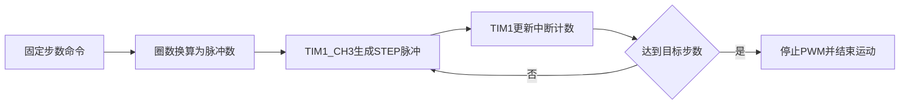

# 步进电机基础控制计划

## 当前代码结论
- [Core/Src/main.c](C:/Users/henry/Desktop/stepmotor/stepmotor/Core/Src/main.c) 实际使用 `TIM1_CH3`、PA10，不是 TIM3；当前 `Prescaler=0`、`Period=65535`、`Pulse=0`，且没有启动 PWM。
- [Core/Src/stm32f1xx_hal_msp.c](C:/Users/henry/Desktop/stepmotor/stepmotor/Core/Src/stm32f1xx_hal_msp.c) 已完成 TIM1 时钟和 PA10 复用输出，但关闭了 SWD/JTAG 调试接口。
- [Core/Inc/main.h](C:/Users/henry/Desktop/stepmotor/stepmotor/Core/Inc/main.h) 已定义方向 PB0、使能 PB3、脉冲 PA10。
- [Core/Src/stm32f1xx_it.c](C:/Users/henry/Desktop/stepmotor/stepmotor/Core/Src/stm32f1xx_it.c) 目前没有 TIM1 中断处理，因此无法可靠统计固定步数。

## 实施方案
1. 在 `main.c` 的用户代码区增加步进电机状态和接口：使能、设置方向、按圈数/步数启动、停止，以及运行状态查询；固定常量 `STEPS_PER_REV=6400`。
2. 重新整理 TIM1 PWM 时基，使 PWM 频率明确对应脉冲频率，并设置安全的占空比和初始速度。换算关系为：`pulse_hz = rpm × 6400 / 60`，`steps = revolutions × 6400`。
3. 使用 TIM1 更新事件中断统计脉冲周期；达到目标步数后停止 PWM、关闭使能或保持待机，并提供完成状态。
4. 在 `stm32f1xx_it.c` 中补充 TIM1 更新中断入口和 `HAL_TIM_IRQHandler()`；在 HAL 回调中处理步数完成逻辑。
5. 在 `main()` 中加入一次低速、单方向、固定步数测试，例如先转 1/10 圈或 1 圈，避免上电立即高速运行；在启动前预留 DIR 建立时间。
6. 保留调试能力：将 SWJ 配置调整为至少保留 SWD，避免下载或在线调试被当前 `__HAL_AFIO_REMAP_SWJ_DISABLE()` 关闭。
7. 验证顺序：示波器/逻辑分析仪确认 PA10 频率和脉宽，再确认 DIR/ENA 电平，最后空载测试 6400 脉冲一圈并核对实际角度；驱动器 ENA 的有效电平需按具体型号校准。

## 关键数据流

暂不加入复杂加减速和串口协议；先验证基础脉冲链路和一圈定位，后续再扩展调速、加减速与多次运动命令。